# ReplenishAI Architecture Documentation

## Current Prototype vs Future Implementation

> **Note**: This prototype demonstrates core functionality. The agentic AI layer represents the **future implementation roadmap** using frameworks like LangChain for autonomous decision-making.

## System Architecture (Future Implementation)

```mermaid
flowchart LR
    A[👤 User] --> B[🖥️ Dashboard]
    B --> C{🤖 AI Coordinator<br/>Future: LangChain}

    C --> D[📊 Demand<br/>Analysis]
    C --> E[🏭 Supplier<br/>Selection]
    C --> F[⚠️ Risk<br/>Assessment]

    D --> G[⚙️ Core Engine<br/>Current Implementation]
    E --> G
    F --> G

    G --> H[(💾 Data Files)]

    style A fill:#ffffff,stroke:#333333,stroke-width:2px,color:#000000
    style B fill:#ffffff,stroke:#1976d2,stroke-width:2px,color:#000000
    style C fill:#ffffff,stroke:#ff9800,stroke-width:2px,color:#000000
    style D fill:#ffffff,stroke:#4caf50,stroke-width:2px,color:#000000
    style E fill:#ffffff,stroke:#4caf50,stroke-width:2px,color:#000000
    style F fill:#ffffff,stroke:#4caf50,stroke-width:2px,color:#000000
    style G fill:#ffffff,stroke:#9c27b0,stroke-width:2px,color:#000000
    style H fill:#ffffff,stroke:#607d8b,stroke-width:2px,color:#000000
```

## Current Prototype Architecture

```mermaid
flowchart LR
    A[👤 User] --> B[🖥️ Streamlit UI]
    B --> C[⚙️ Recommendation Engine]
    C --> D[(📁 CSV Data)]

    style A fill:#f5f5f5,stroke:#333,stroke-width:2px,color:#000
    style B fill:#f5f5f5,stroke:#2196f3,stroke-width:2px,color:#000
    style C fill:#f5f5f5,stroke:#4caf50,stroke-width:2px,color:#000
    style D fill:#f5f5f5,stroke:#ff9800,stroke-width:2px,color:#000
```

## Data Flow

## Implementation Phases

### Phase 1: Current Prototype ✅

- Streamlit dashboard
- Core recommendation engine
- CSV data integration
- Multi-criteria supplier scoring

### Phase 2: Agentic AI Layer (Future) 🚀

- **LangChain integration** for autonomous agents
- **Natural language processing** for supply chain insights
- **Multi-agent coordination** for complex decisions
- **Real-time learning** from user feedback
